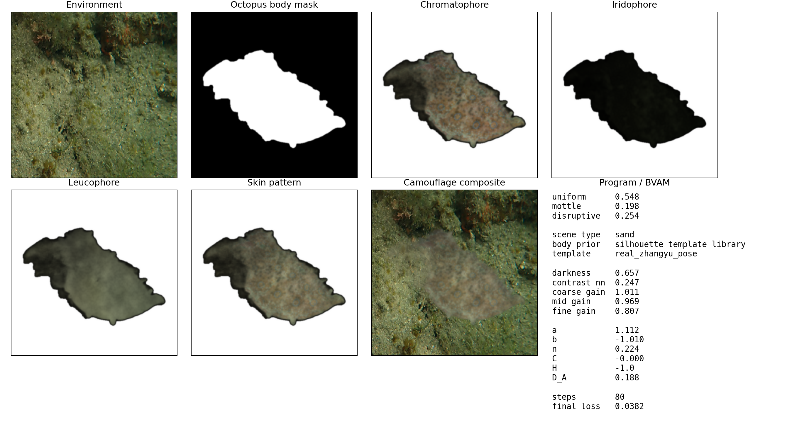
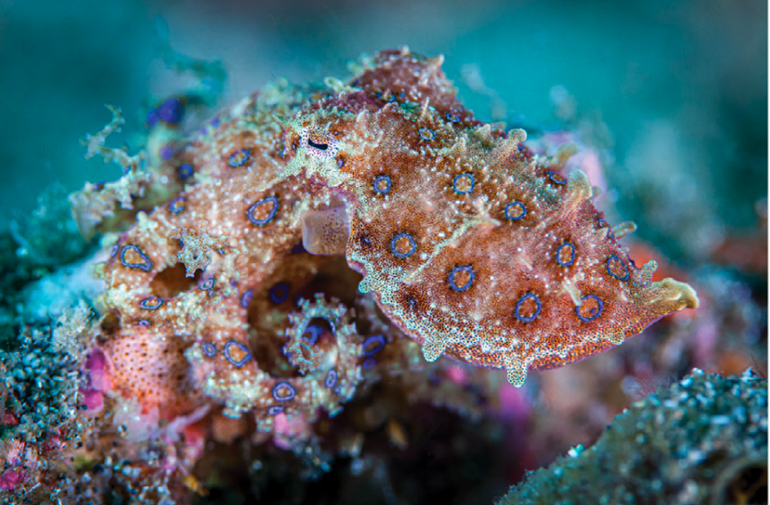
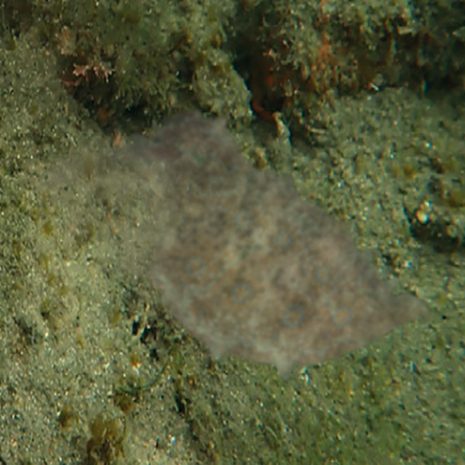
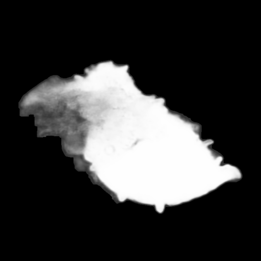

# 神经控制与 Turing 模式耦合的头足类伪装计算模拟

<p align="center">
  一个把环境视觉分析、神经控制器、多尺度 Turing / BVAM 图案生成、身体先验和三层皮肤渲染整合到一起的头足类伪装计算模拟原型。
</p>

<p align="center">
  <a href="./docs/paper_design.md">论文草稿</a> ·
  <a href="./docs/paper_design.pdf">PDF</a> ·
  <a href="./docs/camouflage_pipeline.md">算法流程图</a>
</p>

## 项目概览

这个项目不是“直接生成一张章鱼贴图”，而是把头足类伪装拆成几个可解释层次：

- 环境视觉编码：亮度、对比度、边缘、频谱、方向性
- 神经控制层：预测 `uniform / mottle / disruptive` 和多尺度增益
- 图案生成层：用多尺度 `BVAM / Turing` 形成局部皮肤纹理
- 身体先验层：支持程序模板、真实 silhouette 模板库和参考图分割
- 皮肤渲染层：组合 `chromatophore / iridophore / leucophore`

这条主线更接近“视觉输入 -> 中央控制 -> 局部皮肤组织”的生物启发逻辑，而不是把问题当成普通的端到端图像生成。

## 结果预览

### 主线版本

当前最稳定的主线版本是卷积式神经控制器：

- 输出目录：`outputs/neural_conv_turing_demo_20260403_0053`
- 代表性结果：`final loss = 0.0382`

<p align="center">
  
</p>

<table>
  <tr>
    <td width="50%" align="center">
      
    </td>
    <td width="50%" align="center">
      
    </td>
  </tr>
  <tr>
    <td align="center">章鱼参考图</td>
    <td align="center">环境中的最终合成结果</td>
  </tr>
</table>

### 参考图处理链路

如果给 `--body-ref`，项目不会直接把参考图贴到结果上，而是先经过：

`reference image -> mask raw -> mask clean -> cutout -> texture prior -> final composite`

<table>
  <tr>
    <td></td>
    <td></td>
    <td></td>
  </tr>
  <tr>
    <td align="center">reference image</td>
    <td align="center">body_ref_mask_clean</td>
    <td align="center">body_ref_texture_prior</td>
  </tr>
</table>

## 核心方法

### 1. 环境视觉编码

从环境图像中提取：

- 亮度
- 局部对比度
- 边缘强度
- 细/中/粗三尺度纹理能量
- 频谱特征
- 方向性统计

### 2. 神经控制模块

神经网络不直接输出整张皮肤图，而是输出控制量：

- `uniform / mottle / disruptive`
- `coarse gain / mid gain / fine gain`
- `delta C / delta D_A / delta n`

这样保留了“中央控制 + 局部自组织”的层级关系。

### 3. 多尺度 BVAM / Turing 图案生成

局部皮肤纹理由多尺度 reaction-diffusion 生成：

- 粗尺度：决定大块 body pattern 结构
- 中尺度：决定 cluster 和 mottle
- 细尺度：决定更接近 chromatophore grain 的颗粒感

### 4. 三层皮肤渲染

- `chromatophore`：主色素与主要明暗纹理
- `iridophore`：冷暖偏移和结构色近似
- `leucophore`：底层亮度支撑

## 生物学与工程边界

这个项目是生物启发计算原型，不是真实章鱼脑和皮肤的逐细胞仿真。

直接借鉴的生物学概念：

- 环境视觉经过中央控制后驱动 body pattern
- `uniform / mottle / disruptive` 作为高层伪装程序
- 局部相互作用可由 Turing / reaction-diffusion 描述
- 颜色来源不只是一层色素，还涉及 `iridophore` 和 `leucophore`

工程近似部分：

- 环境图到 BVAM 参数的映射是工程拟合
- `reflectin / iridophore` 只是近似外观层，不是严格光学仿真
- 当前 `body-ref` 主要还是 2D silhouette 先验
- 还没有真实的 `papillae` 几何、三维姿态和肌肉驱动

## 快速开始

先激活环境：

```bash
conda activate cephalocam
```

运行主线版本：

```bash
python octopus_camouflage.py \
  --env input/reef1.png \
  --body-template auto \
  --output-dir outputs/neural_turing_demo
```

如果要启用参考图先验：

```bash
python octopus_camouflage.py \
  --env input/reef1.png \
  --body-ref input/章鱼.png \
  --output-dir outputs/real_run_ref_zhangyu
```

如果要导出论文 PDF：

```bash
python scripts/export_paper_pdf.py
```

默认会生成：

- `docs/paper_design.pdf`

## 主要输入与输出

### 输入

- 环境图：`input/reef1.png`
- 章鱼参考图：`input/章鱼.png`
- 失败案例参考图：`input/Octopus.jpg`

### 输出

每次运行通常会得到：

- `octopus_skin.png`
- `chromatophore_layer.png`
- `iridophore_layer.png`
- `leucophore_layer.png`
- `octopus_on_environment.png`
- `diagnostics.png`

如果使用 `--body-ref`，还会额外输出：

- `body_ref_mask_raw.png`
- `body_ref_mask_clean.png`
- `body_ref_cutout.png`
- `body_ref_texture_prior.png`

## 文档

- [论文草稿](./docs/paper_design.md)
- [论文 PDF](./docs/paper_design.pdf)
- [算法流程图](./docs/camouflage_pipeline.md)

## 仓库结构

```text
.
├── octopus_camouflage.py
├── scripts/
│   └── export_paper_pdf.py
├── docs/
│   ├── paper_design.md
│   ├── paper_design.pdf
│   └── camouflage_pipeline.md
├── input/
├── outputs/
└── assets/
```

## 参考文献

- Iskarous K, Mather J, Alupay J. *A Turing-based bimodal population code can specify Cephalopod chromatic skin displays*. https://arxiv.org/abs/2205.11500
- Ishida T. *A model of octopus epidermis pattern mimicry mechanisms using inverse operation of the Turing reaction model*. https://pubmed.ncbi.nlm.nih.gov/34379702/
- Montague TG. *Neural control of cephalopod camouflage*. https://pubmed.ncbi.nlm.nih.gov/37875091/
- Messenger JB. *Cephalopod chromatophores: neurobiology and natural history*. https://doi.org/10.1017/S1464793101005772
- *Reconstruction of Dynamic and Reversible Color Change using Reflectin Protein*. https://www.nature.com/articles/s41598-019-41638-8
