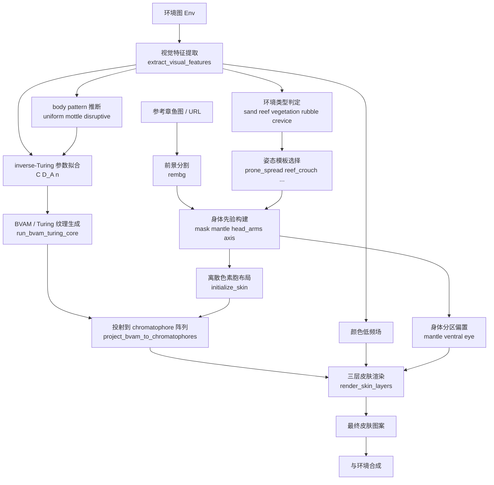

# Cephalopod Camouflage Data Flow

这份图不是泛泛而谈，而是对齐当前 [octopus_camouflage.py](/Users/junye/Documents/code/visualstudio/cephalopod%20camouflage/octopus_camouflage.py) 的实现结构，说明：

- 现在已经实现了什么
- 哪些地方可以接公开数据
- 哪些层级仍然只是工程近似

## 总体流程

## 当前代码对应

### 1. 输入层

- 环境图：`--env`
- 参考外形图：`--body-ref`

当前状态：
- `--env` 已经稳定
- `--body-ref` 已支持本地路径和 URL
- `--body-ref` 目前只提供 2D silhouette 先验，不提供真实三维姿态

### 2. 视觉特征层

函数入口：
- `extract_visual_features`
- `infer_body_pattern_program`
- `inverse_turing_fit`

当前提取的特征包括：
- 亮度
- 局部对比度
- 边缘强度
- 细/中/粗尺度纹理
- 亮斑
- 频谱低中高频占比
- 梯度方向各向异性

这些特征用于两件事：
- 推断 `uniform / mottle / disruptive`
- 拟合 `BVAM` 参数 `C / D_A / n`

### 3. 身体先验层

函数入口：
- `create_octopus_mask`
- `create_body_maps_from_reference`

当前两种来源：
- 没有 `--body-ref`：先判定环境类型，再从内置模板库选择姿态模板
- 有 `--body-ref`：走分割得到的参考图 body prior

当前内置模板：
- `prone_spread`
- `photo_sprawl`
- `prone_tucked`
- `reef_crouch`
- `algae_reach`
- `crevice_anchor`
- `real_zhangyu_pose`

输出图层：
- `mask`
- `alpha`
- `mantle`
- `head_arms`
- `eye`
- `ventral`
- `axis_u`
- `axis_v`

这些图层决定的不是“颜色本身”，而是：
- 图案该主要落在哪个身体区域
- 背腹明暗如何偏置
- 眼区是否保留生物识别锚点
- 身体轴向上的条纹/斑驳如何组织

### 4. 纹理生成层

函数入口：
- `run_bvam_turing_core`

当前实现：
- 使用 BVAM reaction-diffusion 方程
- 环境特征作为初始扰动和弱 forcing
- 输出连续激活场 `a_field`

这一层负责回答：
- 图案是点状、斑驳还是块状
- 纹理尺度偏细还是偏粗
- 图案的空间组织如何展开

### 5. 色素胞层

函数入口：
- `initialize_skin`
- `project_bvam_to_chromatophores`

当前实现：
- 在身体 mask 内放置离散 chromatophore 单元
- 每个单元都有颜色类型和扩张度
- BVAM 激活场被投射到这些离散单元上

这比“直接把整张纹理图贴到身体上”更接近头足类皮肤的离散色素胞机制。

### 6. 光学渲染层

函数入口：
- `render_skin_layers`

当前三层：
- `chromatophore`
- `iridophore`
- `leucophore`

作用分工：
- `chromatophore`：黄/棕/黑色素主体
- `iridophore`：蓝绿/金色结构反射近似
- `leucophore`：高亮底层和亮度扩散

这里仍是生物启发渲染，不是严格光学仿真。

## 可接入的数据类型

### A. 公开图像 / 视频数据

适合接入位置：
- 环境图输入
- 参考姿态模板库
- 伪装前后对照评估

可直接用于：
- 生成 body prior
- 统计不同背景下的纹理频谱
- 建立“环境类型 -> 模式类型”的经验映射

### B. 色素胞级跟踪数据

适合接入位置：
- `initialize_skin`
- `project_bvam_to_chromatophores`

可替换的内容：
- 色素胞密度
- 单元大小分布
- 邻域耦合强度
- 扩张/收缩速度

### C. 神经控制数据

适合接入位置：
- `infer_body_pattern_program`
- `inverse_turing_fit`

可替换的内容：
- 从视觉特征到 `uniform / mottle / disruptive` 的映射
- 从高层模式到局部色素控制的控制矩阵

### D. 反射素 / 结构色数据

适合接入位置：
- `render_skin_layers`

可替换的内容：
- 结构色角度响应
- 光谱反射曲线
- 不同组织层的混合模型

## 当前实现和理想实验模型的差距

当前已经有：
- 环境驱动
- 参考图外形先验
- Turing/BVAM 纹理核心
- 离散色素胞
- 三层颜色渲染

当前还没有：
- 真实逐色素胞时间序列数据拟合
- 真实神经 spike train 到皮肤图案的控制链
- papillae 体表起伏
- 三维几何和水下光照
- 多姿态模板检索与形变

## 最推荐的下一步

如果你接下来要继续做，而不是停在概念图层面，优先级应该是：

1. 建一个 `body prior` 模板库
   来源可以是 10 到 30 张公开章鱼照片，按姿态分类。

2. 做“环境类型 -> 姿态模板”选择
   沙地、礁石、海藻背景不一定对应同一姿态。

3. 再引入公开视频做动态参数拟合
   这一步才值得开始调时间常数和色素胞响应速度。

4. 最后才考虑更严格的 reflectin / iridophore 光学模型

原因很简单：
目前最明显的误差，先不是颜色，而是外形和姿态。
