# 神经控制与 Turing 模式耦合的头足类伪装计算模拟

作者：叶俊

<style>
p.indent {
  text-indent: 2em;
  margin: 0 0 1em 0;
  line-height: 1.9;
}
table.figure-grid {
  width: 100%;
  table-layout: fixed;
  border-collapse: collapse;
  margin: 0.8em 0 0.4em 0;
}
table.figure-pair {
  width: 100%;
  table-layout: fixed;
  border-collapse: collapse;
  margin: 0.4em 0 0.4em 0;
}
table.figure-grid td {
  width: 33.33%;
  padding: 6px;
  vertical-align: top;
}
table.figure-pair td {
  width: 50%;
  padding: 6px;
  vertical-align: top;
}
table.figure-grid img {
  width: 100%;
  display: block;
  border: 1px solid #d8d8d8;
}
table.figure-pair img {
  width: 100%;
  display: block;
  border: 1px solid #d8d8d8;
}
table.data-table {
  width: 100%;
  border-collapse: collapse;
  table-layout: fixed;
  margin: 0.8em 0 1em 0;
  font-size: 10pt;
}
table.data-table th,
table.data-table td {
  border: 1px solid #888;
  padding: 6px 8px;
  vertical-align: top;
  overflow-wrap: anywhere;
  word-break: break-word;
}
table.data-table th {
  background: #f4f1ea;
  font-weight: 600;
}
table.data-table td.num,
table.data-table th.num {
  text-align: center;
}
tr.figure-labels td {
  text-align: center;
  font-size: 0.9em;
  color: #555;
  padding-top: 2px;
}
</style>

## 摘要

<p class="indent">头足类伪装是一个由环境视觉分析、中央神经控制和皮肤局部图案形成共同驱动的多层级过程。现有研究通常分别从神经机制、反应扩散图案模型和外观合成方法三个方向切入，但较少有工作把它们统一到同一个可运行的计算模拟系统中。本文提出一个受头足类伪装启发的分层计算框架：模型首先从环境图像中提取亮度、对比度、边缘、纹理频谱与方向性特征；随后通过一个神经控制模块预测高层 body pattern 程序以及多尺度 Turing 参数调制量；再由多尺度 BVAM reaction-diffusion 生成粗、中、细三层皮肤图案场，并结合 chromatophore、iridophore 与 leucophore 三层皮肤渲染形成最终外观。为了更接近真实伪装中的渐进匹配过程，本文还引入了基于环境特征与当前皮肤特征差异的反馈机制。</p>

<p class="indent">基于当前项目中已经输出的多个版本结果，本文进一步比较了纯启发式、单尺度 BVAM、多层皮肤渲染、真实 silhouette 先验以及神经网络控制版本的差异。结果表明，神经控制模块并没有破坏原有生物启发结构，反而在保持 coarse 纹理组织的同时有效抑制了过假的高频斑点；其中卷积式神经控制版本在当前实验中获得最低的 <span style="color:#d97a32; font-weight:600;">final loss = 0.0382</span>。本文不声称复现实验动物的真实神经回路，而是提出一个兼具可解释性、可运行性与跨学科整合能力的生物启发计算模型。</p>

**关键词**：头足类伪装；神经控制；Turing 模式；reaction-diffusion；生物启发计算；章鱼皮肤模拟

## 1. 引言

<p class="indent">伪装是自然界中最复杂的视觉适应行为之一，而章鱼、乌贼和墨鱼等头足类动物由于能够在极短时间内改变体表亮度、对比度、空间纹理与整体图案组织，成为研究动物外观调节与神经控制机制的典型对象。</p>

<p class="indent">头足类伪装并不是简单的颜色变化，而是一个从环境感知、高层程序选择到底层皮肤单元协同变化的多层级系统。正因如此，它长期同时吸引着神经生物学、数学建模、计算机视觉和图形学研究者。</p>

<p class="indent">现有工作虽然丰富，但存在明显断层。神经生物学研究强调视觉输入如何被中央神经系统处理，并最终驱动大规模色素胞和 body pattern 程序；这类研究能够解释“为什么会触发某种伪装模式”，却很少直接给出可运行算法。</p>

<p class="indent">Turing 模式和 reaction-diffusion 模型则能够优雅地解释 spots、stripes、mottle 与 blotch 等局部皮肤纹理如何由相互作用自组织形成，但通常缺少从环境图像到图案控制参数的上游桥接。另一方面，现代生成模型可以从图像中直接合成纹理或外观，却往往把头足类伪装当成普通图像生成问题，难以保留足够的生物学结构解释。</p>

<p class="indent">本文工作的直接动机，来自头足类伪装神经机制研究，尤其是北大相关讲座与动态伪装研究所代表的分层控制视角。本文不试图声称已经逐神经元复现章鱼脑，而是把“视觉到皮肤”的问题改写为一个更稳妥的计算模拟问题：环境图像先被编码为统计特征，再由神经控制模块输出高层 body pattern 程序以及多尺度 Turing 参数，最终驱动局部皮肤图案生成与分层渲染。</p>

<p class="indent">这种建模方式既尽量保留了生物学启发中的层级逻辑，也为计算模拟提供了明确的控制变量和可解释接口。</p>

<p class="indent">本文的主要贡献可以概括为三点。第一，提出一个将环境感知、神经控制与反应扩散图案生成统一起来的分层计算框架。第二，将神经网络明确放在“视觉到控制参数映射”这一中间层，而不是直接生成整张皮肤图像，从而保留解释性。第三，结合多尺度 BVAM/Turing 生成、身体先验和三层皮肤渲染机制，构建出一个可运行的头足类伪装模拟系统，并基于项目当前多个版本输出对其进行定性与消融分析。</p>

## 2. 相关工作

### 2.1 头足类伪装的神经与行为控制

<p class="indent">相关神经生物学研究普遍认为，头足类伪装并不是皮肤局部的被动反射，而是一个由环境视觉分析、中央控制与外围执行共同组成的分层系统。`uniform`、`mottle`、`disruptive` 等 body pattern 概念为本文提供了高层控制变量的生物学动机；动态背景匹配研究则说明，伪装过程更适合被建模为渐进反馈过程，而不是一次性静态映射。</p>

### 2.2 Turing 与 reaction-diffusion 皮肤图案模型

<p class="indent">Turing 模式和 reaction-diffusion 模型是本文局部皮肤图案生成的数学基础。相关工作已经证明，这类模型能够生成与头足类皮肤相似的斑点、条纹和斑驳纹理；BVAM 一类双变量系统则使不同图案区间之间的切换更稳定。本文沿用这一思路，但只把它作为局部皮肤动力学层，而不是把整个伪装过程简化为单一反应扩散系统。</p>

### 2.3 生物启发的可控外观生成

<p class="indent">在图形学与视觉领域，条件纹理生成和外观合成已经较为成熟，但多数方法强调的是视觉真实感，而不是生物学可解释性。本文与这类方法的区别，不在于是否使用神经网络，而在于神经网络只负责“环境特征到控制参数”的桥接，而不直接吞掉整张皮肤图生成任务。</p>

## 3. 方法

### 3.1 总体框架

<p class="indent">本文模型由四个层次构成：</p>

1. 环境视觉编码
2. 神经控制模块
3. 多尺度 BVAM / Turing 图案生成
4. 三层皮肤渲染与反馈更新

<p class="indent">整体流程如下：</p>

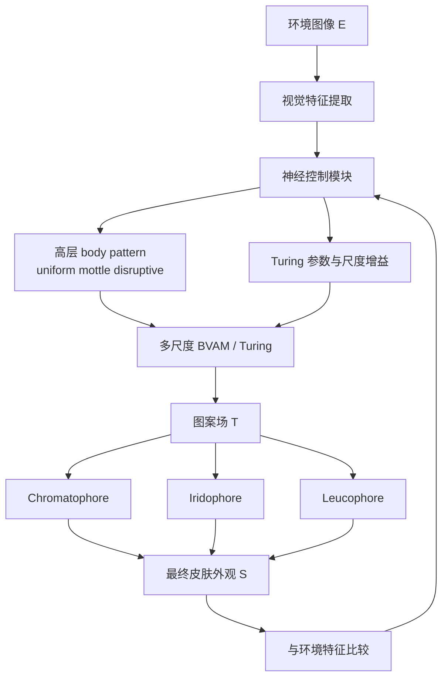

### 3.2 问题定义

<p class="indent">给定环境图像 `E` 和身体先验 `B`，模型输出伪装皮肤外观 `S`。核心中间变量包括环境特征 `F_env`、神经控制状态 `z`、高层 body pattern 程序 `p`、多尺度 Turing 参数 `lambda` 以及图案场 `T`：</p>

- `F_env = f(E)` 表示环境视觉特征
- `z = g(F_env)` 表示神经控制状态
- `p = h_p(z)` 表示高层 body pattern 程序
- `lambda = h_lambda(z, p)` 表示 BVAM 参数和尺度增益
- `T = RD(lambda, B)` 表示多尺度反应扩散生成场
- `S = R(T, B, E)` 表示最终皮肤渲染输出

<p class="indent">与直接图像生成不同，本文显式保留 `p`、`lambda` 和 `T`，以保证模型解释性。</p>

### 3.3 环境视觉编码

<p class="indent">环境视觉编码器不追求高维语义，而是直接提取与伪装控制相关的统计量，包括：</p>

- 亮度
- 局部对比度
- 边缘强度
- 细、中、粗三尺度纹理能量
- 亮斑统计
- 频谱特征
- 方向性统计

<p class="indent">这些特征既用于环境类型判断，也作为神经控制模块的输入。</p>

### 3.4 神经控制模块

<p class="indent">神经控制模块不直接输出整张皮肤图像，而是输出一组控制量：</p>

- `uniform / mottle / disruptive`
- `coarse gain / mid gain / fine gain`
- BVAM 参数修正项 `delta C / delta D_A / delta n`

<p class="indent">这样做的目的，是保留“中央控制 + 局部生成”的层级关系。</p>

### 3.5 多尺度 BVAM / Turing 图案生成

<p class="indent">单尺度 reaction-diffusion 难以表达真实头足类皮肤中的多层纹理，因此本文采用三尺度 BVAM/Turing 生成：</p>

- 粗尺度：决定大块明暗结构与 body pattern 布局
- 中尺度：生成 mottle 和 cluster
- 细尺度：生成更接近 chromatophore grain 的颗粒感

设三个尺度的图案场分别为 `T_c`、`T_m` 与 `T_f`，则总图案场为：

```text
T = alpha_c T_c + alpha_m T_m + alpha_f T_f
```

<p class="indent">其中 `alpha_c`、`alpha_m` 和 `alpha_f` 由神经控制模块输出。</p>

### 3.6 身体先验与空间约束

<p class="indent">身体先验 `B` 决定图案落在什么轮廓与分区上。当前系统支持三类 body prior：</p>

- 程序模板
- silhouette 模板库
- 参考图分割结果

先验至少包含：

- 整体 mask
- mantle 区
- head-arms 区
- 局部轴向场

<p class="indent">从当前实验看，body prior 对最终视觉结果的影响往往大于再微调一轮 BVAM 参数。</p>

#### 3.6.1 参考图 body prior 处理流程

<p class="indent">为了让读者明确理解 `--body-ref` 这条链路，本文保留并展示了参考图处理中间结果。当前处理流程不是“直接拿参考图贴上去”，而是依次经过：原始参考图、前景分割得到的 `body_ref_mask_raw`、形态学清洗后的 `body_ref_mask_clean`、按 clean mask 裁出的 `body_ref_cutout`，以及最终进入渲染阶段的 `body_ref_texture_prior`。</p>

<p class="indent">下面给出一组实际中间结果示意。这里把原图、分割结果和最终合成一起放进来，这样读者可以直接看到从参考图到 body prior 的完整路径。</p>

<table class="figure-grid">
  <tr>
    <td></td>
    <td>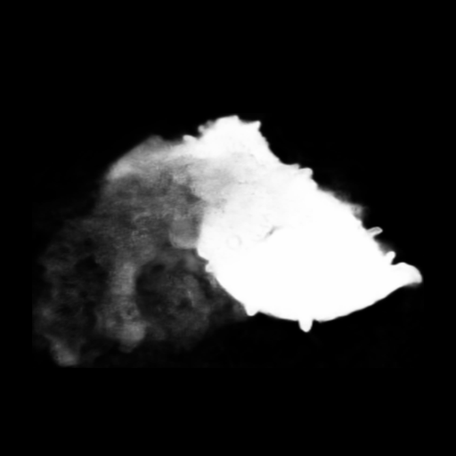</td>
    <td></td>
  </tr>
  <tr class="figure-labels">
    <td align="center">reference image</td>
    <td align="center">body_ref_mask_raw</td>
    <td align="center">body_ref_mask_clean</td>
  </tr>
  <tr>
    <td>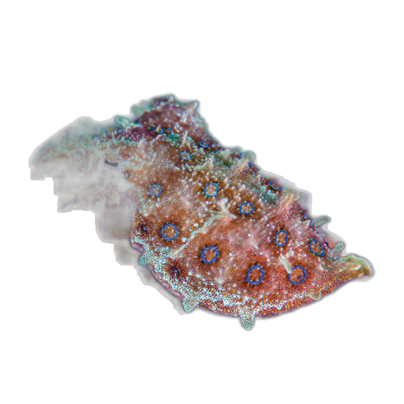</td>
    <td></td>
    <td>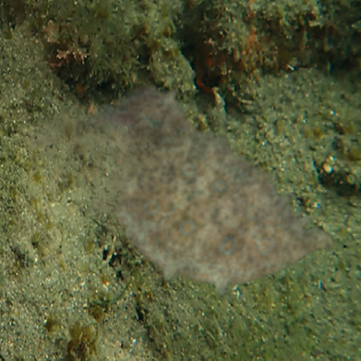</td>
  </tr>
  <tr class="figure-labels">
    <td align="center">body_ref_cutout</td>
    <td align="center">body_ref_texture_prior</td>
    <td align="center">octopus_on_environment</td>
  </tr>
</table>

**图 1**　参考图 body prior 处理流程示意。从左到右、从上到下依次为：原始参考图、原始分割 `body_ref_mask_raw`、清洗后的 `body_ref_mask_clean`、前景 `body_ref_cutout`、纹理先验 `body_ref_texture_prior` 以及基于该先验得到的环境合成结果。

<p class="indent">这组图说明了本文如何把“外形先验”和“纹理先验”分开处理，而不是简单把参考图直接贴到结果上。对本文而言，`body_ref_mask_clean` 决定的是几何支持域，而 `body_ref_texture_prior` 决定的是高频皮肤质感来源。</p>

### 3.7 三层皮肤渲染

<p class="indent">图案场 `T` 并不直接等于最终外观。为了更接近头足类皮肤结构，本文把渲染过程拆成三层：</p>

- `chromatophore`：主色素与主要明暗纹理
- `iridophore`：结构色与冷暖偏移
- `leucophore`：底层亮度支撑与扩散感

最终输出为三层叠加：

```text
S = w_chr S_chr + w_iri S_iri + w_leu S_leu
```

<p class="indent">各层强度由图案场、身体分区和环境低频颜色共同调节。</p>

### 3.8 反馈更新

<p class="indent">为了贴近真实伪装中的渐进匹配过程，模型在前向生成之外加入反馈更新。每轮迭代中提取环境特征 `F_env` 与当前皮肤特征 `F_skin`，并根据二者差异修正 body pattern 权重和 BVAM 参数。</p>

## 4. Experiments

<p class="indent">本节不再停留在理论设计，而是直接分析当前项目已经生成的版本输出。实验环境主要围绕 `input/reef1.png` 这一类沙地加礁石背景展开。由于项目目前仍是方法原型，本文重点采用定性对比、参数趋势和消融式版本比较，而不是大规模统计实验。</p>

### 4.1 Qualitative Comparison

<p class="indent">本节选择六个代表性版本进行比较：早期启发式 / BVAM 阶段、混合渲染阶段、多尺度模板阶段、真实 silhouette 模板阶段、神经网络控制阶段、卷积式神经控制阶段。每个版本均同时展示诊断图和最终环境合成图。</p>

#### 4.1.0 参考图处理直观示例

<p class="indent">在进入各版本对比之前，先展示一组“原始章鱼参考图 -> 分割与清洗 -> cutout -> texture prior -> 最终合成”的完整链路。这样读者可以先理解 body prior 和 texture prior 是如何产生的，再去看后面的版本差异。</p>

<table class="figure-grid">
  <tr>
    <td></td>
    <td></td>
    <td></td>
  </tr>
  <tr class="figure-labels">
    <td align="center">reference image</td>
    <td align="center">body_ref_mask_raw</td>
    <td align="center">body_ref_mask_clean</td>
  </tr>
  <tr>
    <td></td>
    <td></td>
    <td></td>
  </tr>
  <tr class="figure-labels">
    <td align="center">body_ref_cutout</td>
    <td align="center">body_ref_texture_prior</td>
    <td align="center">octopus_on_environment</td>
  </tr>
</table>

**图 2**　实验部分中的参考图处理直观示例。该图把原图、分割、clean mask、cutout、纹理先验和最终合成结果放到同一张图中，便于读者理解 body prior 链路。

#### 4.1.1 早期启发式 / 早期 BVAM 阶段

<p class="indent"><strong>版本：</strong><code>real_run</code></p>

<p align="center">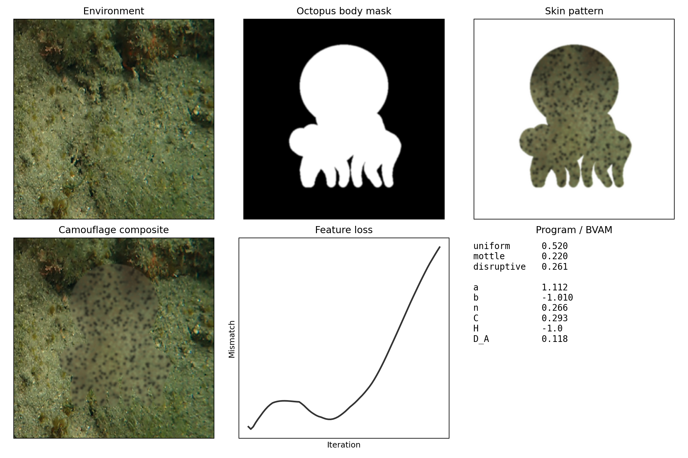</p>
<p align="center"><em>diagnostics</em></p>

<table class="figure-pair">
  <tr>
    <td></td>
    <td>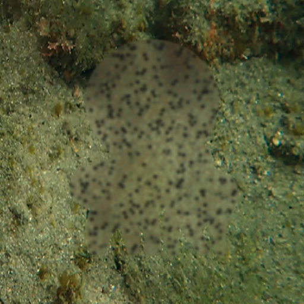</td>
  </tr>
  <tr class="figure-labels">
    <td align="center">reference image</td>
    <td align="center">octopus_on_environment</td>
  </tr>
</table>

**图 3**　早期启发式版本 `real_run` 的统一展示版式。上方单独展示诊断图，下方展示章鱼视觉参照图与最终环境合成图。

<p class="indent"><strong>版本：</strong><code>real_run_bvam_v2</code></p>

<p align="center"></p>
<p align="center"><em>diagnostics</em></p>

<table class="figure-pair">
  <tr>
    <td></td>
    <td></td>
  </tr>
  <tr class="figure-labels">
    <td align="center">reference image</td>
    <td align="center">octopus_on_environment</td>
  </tr>
</table>

**图 4**　早期 BVAM 版本 `real_run_bvam_v2` 的统一展示版式。上方单独展示诊断图，下方展示章鱼视觉参照图与最终环境合成图。

<p class="indent">这一阶段的典型参数为：</p>

- `uniform 0.520`
- `mottle 0.220`
- `disruptive 0.261`
- `n 0.266`
- `C 0.293`
- `D_A 0.118`
- `final loss 0.143`

<p class="indent">这一阶段已经具备基本的环境匹配意识，但问题很明显：body mask 是卡通章鱼模板，`C` 偏高使斑点过硬，最终结果更像“灰色身体上撒黑点”，而不像真实章鱼皮肤。</p>

#### 4.1.2 混合渲染阶段

<p align="center">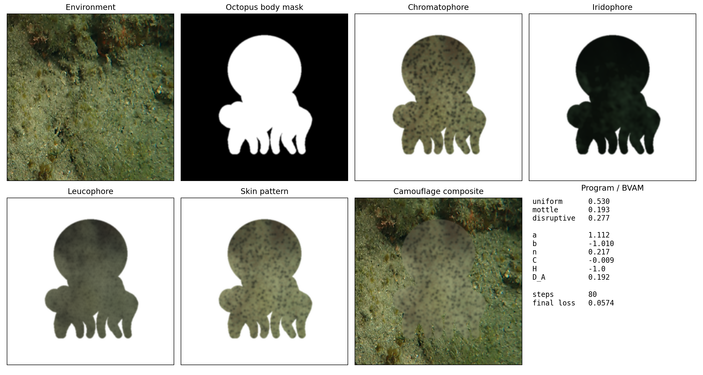</p>
<p align="center"><em>diagnostics</em></p>

<table class="figure-pair">
  <tr>
    <td></td>
    <td>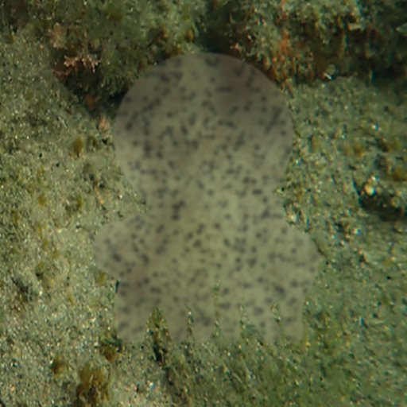</td>
  </tr>
  <tr class="figure-labels">
    <td align="center">reference image</td>
    <td align="center">octopus_on_environment</td>
  </tr>
</table>

**图 5**　混合渲染版本 `real_run_hybrid` 的统一展示版式。上方单独展示诊断图，下方展示章鱼视觉参照图与最终环境合成图。

<p class="indent">这一版的典型参数为：</p>

- `uniform 0.530`
- `mottle 0.193`
- `disruptive 0.277`
- `n 0.217`
- `C -0.009`
- `D_A 0.192`
- `final loss 0.0574`

<p class="indent">这一阶段最重要的进步，不是“更像章鱼”，而是三层皮肤渲染建立起来了。`C` 从正值回落到接近 `0`，`D_A` 明显提高，说明图案开始从硬斑点过渡到更平缓的沙地纹理。但由于 body prior 仍然错误，最终依旧像“贴了皮肤纹理的图标”。</p>

#### 4.1.3 多尺度纹理但仍为程序模板

<p align="center">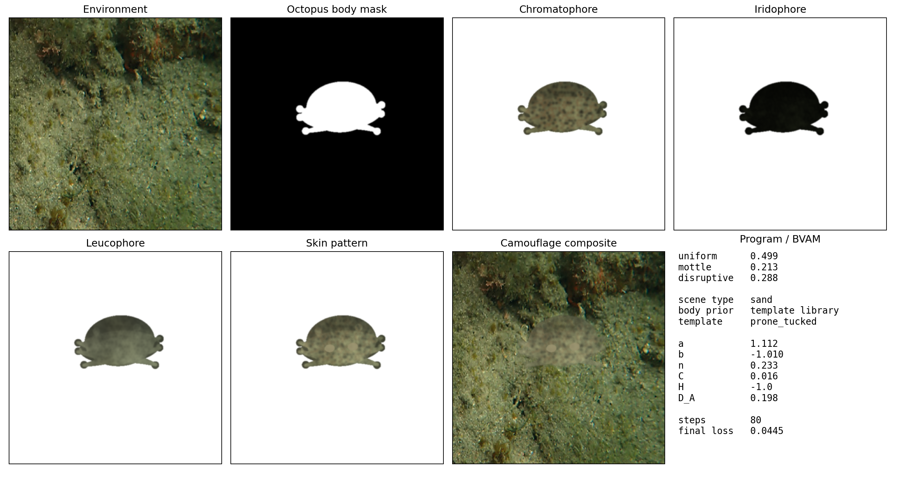</p>
<p align="center"><em>diagnostics</em></p>

<table class="figure-pair">
  <tr>
    <td></td>
    <td>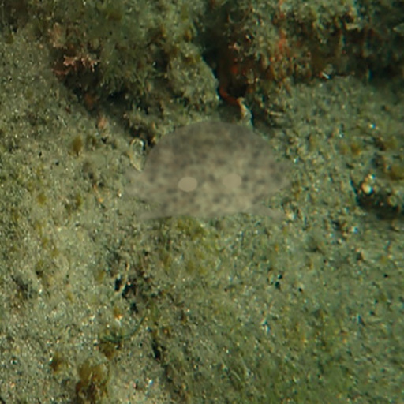</td>
  </tr>
  <tr class="figure-labels">
    <td align="center">reference image</td>
    <td align="center">octopus_on_environment</td>
  </tr>
</table>

**图 6**　多尺度纹理版本 `real_run_multiscale_sand_v1` 的统一展示版式。上方单独展示诊断图，下方展示章鱼视觉参照图与最终环境合成图。

<p class="indent">这一版参数为：</p>

- `uniform 0.499`
- `mottle 0.213`
- `disruptive 0.288`
- `n 0.233`
- `C 0.016`
- `D_A 0.198`
- `final loss 0.0445`

<p class="indent">从参数上看，它已经进入比较合理的沙地伪装区间：`C` 接近 `0`，`D_A` 维持高位，`uniform / mottle / disruptive` 三者更平衡。然而，这一版再次证明了一个事实：`final loss` 下降并不等于“更像章鱼”。因为 body prior 错误，结果视觉上仍像小型卡通生物。</p>

#### 4.1.4 真实 silhouette 模板阶段

<p align="center">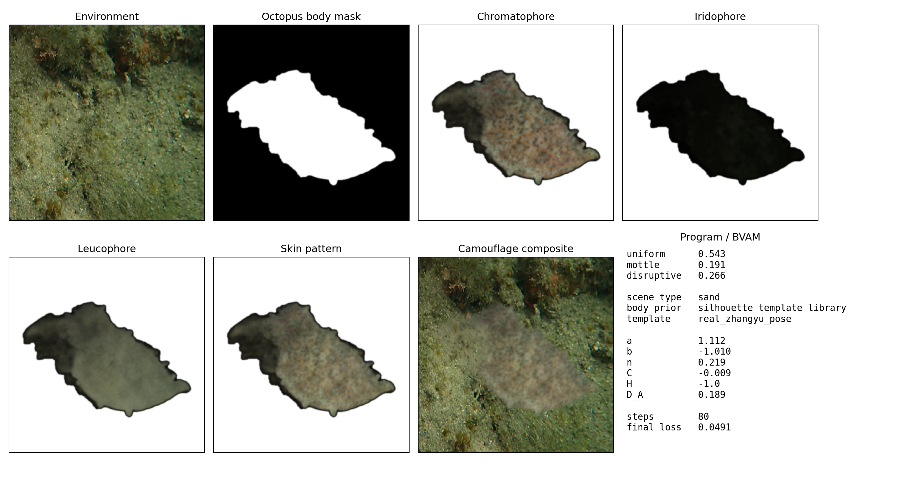</p>
<p align="center"><em>diagnostics</em></p>

<table class="figure-pair">
  <tr>
    <td></td>
    <td>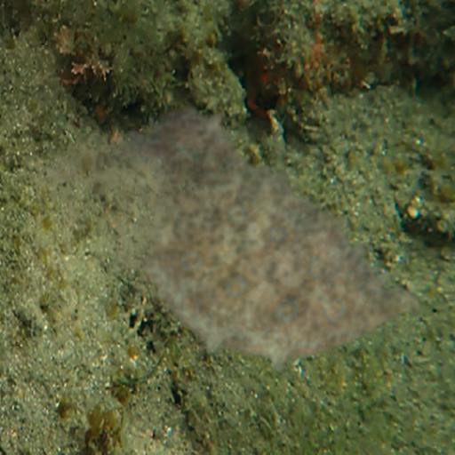</td>
  </tr>
  <tr class="figure-labels">
    <td align="center">reference image</td>
    <td align="center">octopus_on_environment</td>
  </tr>
</table>

**图 7**　真实 silhouette 模板版本 `real_run_auto_realtemplate_20260403_0033` 的统一展示版式。上方单独展示诊断图，下方展示章鱼视觉参照图与最终环境合成图。

<p class="indent">这一版参数为：</p>

- `uniform 0.543`
- `mottle 0.191`
- `disruptive 0.266`
- `n 0.219`
- `C -0.009`
- `D_A 0.189`
- `final loss 0.0491`

<p class="indent">虽然这版的 loss 没有显著优于多尺度模板版，但它在视觉上更有意义：`body prior` 从程序模板变成了 `silhouette template library`，图案第一次真正“落在真实轮廓上”。这表明 body prior 的真实性，对结果像不像章鱼的影响大于小幅参数调节。</p>

#### 4.1.5 神经网络控制阶段

<p align="center">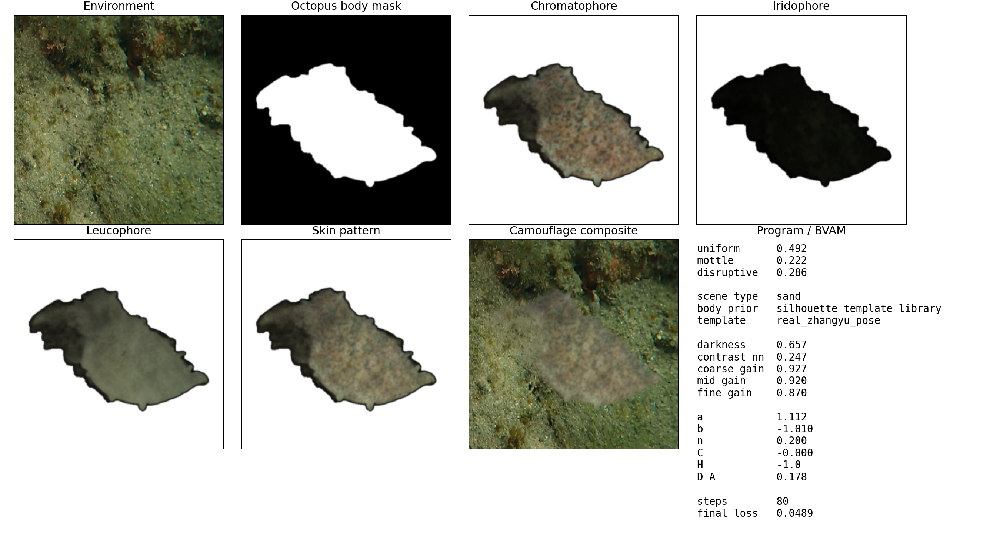</p>
<p align="center"><em>diagnostics</em></p>

<table class="figure-pair">
  <tr>
    <td></td>
    <td></td>
  </tr>
  <tr class="figure-labels">
    <td align="center">reference image</td>
    <td align="center">octopus_on_environment</td>
  </tr>
</table>

**图 8**　神经网络控制版本 `neural_turing_demo_20260403_0037` 的统一展示版式。上方单独展示诊断图，下方展示章鱼视觉参照图与最终环境合成图。

<p class="indent">这一版参数为：</p>

- `uniform 0.492`
- `mottle 0.222`
- `disruptive 0.286`
- `darkness 0.657`
- `contrast nn 0.247`
- `coarse gain 0.927`
- `mid gain 0.920`
- `fine gain 0.870`
- `n 0.200`
- `C -0.000`
- `D_A 0.178`
- `final loss 0.0489`

<p class="indent">这一版第一次真正形成了完整主线：</p>

`环境分析 -> 神经控制器 -> Turing 生成 -> 三层皮肤渲染`

<p class="indent">它最重要的价值不在于一下子变成“很真”的章鱼，而在于神经网络开始承担可解释的控制角色：`fine gain < 1` 表示控制器主动压制过细、过假的噪声，`C ≈ 0` 则抑制了前期那种过强的黑色斑点倾向。</p>

#### 4.1.6 卷积式神经控制阶段

<p align="center"></p>
<p align="center"><em>diagnostics</em></p>

<table class="figure-pair">
  <tr>
    <td></td>
    <td></td>
  </tr>
  <tr class="figure-labels">
    <td align="center">reference image</td>
    <td align="center">octopus_on_environment</td>
  </tr>
</table>

**图 9**　卷积式神经控制版本 `neural_conv_turing_demo_20260403_0053` 的统一展示版式。上方单独展示诊断图，下方展示章鱼视觉参照图与最终环境合成图。

<p class="indent">这一版参数为：</p>

- `uniform 0.548`
- `mottle 0.198`
- `disruptive 0.254`
- `darkness 0.657`
- `contrast nn 0.247`
- `coarse gain 1.011`
- `mid gain 0.969`
- `fine gain 0.807`
- `n 0.224`
- `C -0.000`
- `D_A 0.188`
- `final loss 0.0382`

<p class="indent">这是当前结果中最平衡的一版。与普通神经控制版相比，`coarse gain` 提高到 `1.011`，`fine gain` 降到 `0.807`，说明控制器更偏向保留大尺度组织，同时进一步压制容易显假的细碎高频纹理。当前最低的 `final loss` 也出现在这一版。</p>

### 4.1.7 参数变化趋势总结表

**表 1**　关键版本在 body pattern 权重、BVAM 参数和 `final loss` 上的变化趋势。

<table class="data-table">
  <thead>
    <tr>
      <th style="width: 34%;">版本</th>
      <th class="num" style="width: 9%;">uniform</th>
      <th class="num" style="width: 9%;">mottle</th>
      <th class="num" style="width: 11%;">disruptive</th>
      <th class="num" style="width: 7%;">n</th>
      <th class="num" style="width: 7%;">C</th>
      <th class="num" style="width: 8%;">D_A</th>
      <th class="num" style="width: 15%;">final loss</th>
    </tr>
  </thead>
  <tbody>
    <tr>
      <td><code>real_run / real_run_bvam_v2</code></td>
      <td class="num">0.520</td>
      <td class="num">0.220</td>
      <td class="num">0.261</td>
      <td class="num">0.266</td>
      <td class="num">0.293</td>
      <td class="num">0.118</td>
      <td class="num">0.143</td>
    </tr>
    <tr>
      <td><code>real_run_hybrid</code></td>
      <td class="num">0.530</td>
      <td class="num">0.193</td>
      <td class="num">0.277</td>
      <td class="num">0.217</td>
      <td class="num">-0.009</td>
      <td class="num">0.192</td>
      <td class="num">0.0574</td>
    </tr>
    <tr>
      <td><code>real_run_multiscale_sand_v1</code></td>
      <td class="num">0.499</td>
      <td class="num">0.213</td>
      <td class="num">0.288</td>
      <td class="num">0.233</td>
      <td class="num">0.016</td>
      <td class="num">0.198</td>
      <td class="num">0.0445</td>
    </tr>
    <tr>
      <td><code>real_run_auto_realtemplate_20260403_0033</code></td>
      <td class="num">0.543</td>
      <td class="num">0.191</td>
      <td class="num">0.266</td>
      <td class="num">0.219</td>
      <td class="num">-0.009</td>
      <td class="num">0.189</td>
      <td class="num">0.0491</td>
    </tr>
    <tr>
      <td><code>neural_turing_demo_20260403_0037</code></td>
      <td class="num">0.492</td>
      <td class="num">0.222</td>
      <td class="num">0.286</td>
      <td class="num">0.200</td>
      <td class="num">-0.000</td>
      <td class="num">0.178</td>
      <td class="num">0.0489</td>
    </tr>
    <tr>
      <td><code>neural_conv_turing_demo_20260403_0053</code></td>
      <td class="num">0.548</td>
      <td class="num">0.198</td>
      <td class="num">0.254</td>
      <td class="num">0.224</td>
      <td class="num">-0.000</td>
      <td class="num">0.188</td>
      <td class="num">0.0382</td>
    </tr>
  </tbody>
</table>

<p class="indent">从表中可以直接看出三个趋势：</p>

- `C` 从早期的 `0.293` 回落到接近 `0`，说明系统在摆脱过硬的斑点主导状态。
- `D_A` 从 `0.118` 提升到 `0.178` 到 `0.198` 区间后，沙地背景上的纹理扩散更充分。
- 神经网络版本没有把系统带偏，而是在与非神经网络版本相近的参数区间内，做了更细致的尺度调制。

### 4.2 Quantitative Metrics

<p class="indent">为了使实验部分更符合计算机论文的写法，本文在参数对比之外，进一步补充了基于图像的定量指标。所有指标均在 `octopus_skin.png` 反推出的身体区域内计算，并与同位置的环境图像区域进行比较。表中“越小越好”表示当前皮肤外观在该统计量上更接近背景。</p>

#### 4.2.1 指标定义

<p class="indent">本文使用以下五个定量指标：</p>

- `Luminance Gap`：皮肤与环境在身体区域内的平均亮度差。
- `Contrast Gap`：皮肤与环境在局部对比度统计上的差异。
- `Edge Gap`：皮肤与环境在边缘强度上的差异。
- `Spectrum Gap`：皮肤与环境在低中高频能量分布上的 L1 差异。
- `Final Loss`：当前系统内部的反馈收敛误差。

#### 4.2.2 定量结果

**表 2**　基于输出图像与环境图像对应区域计算的定量指标。各项指标越小，表示该统计量越接近背景。

<table class="data-table">
  <thead>
    <tr>
      <th style="width: 34%;">版本</th>
      <th class="num" style="width: 13%;">Luminance Gap</th>
      <th class="num" style="width: 13%;">Contrast Gap</th>
      <th class="num" style="width: 11%;">Edge Gap</th>
      <th class="num" style="width: 13%;">Spectrum Gap</th>
      <th class="num" style="width: 16%;">Final Loss</th>
    </tr>
  </thead>
  <tbody>
    <tr>
      <td><code>real_run / real_run_bvam_v2</code></td>
      <td class="num">0.1115</td>
      <td class="num">0.0475</td>
      <td class="num">0.0032</td>
      <td class="num">0.1312</td>
      <td class="num">0.1430</td>
    </tr>
    <tr>
      <td><code>real_run_hybrid</code></td>
      <td class="num">0.0939</td>
      <td class="num">0.0608</td>
      <td class="num">0.0148</td>
      <td class="num">0.1121</td>
      <td class="num">0.0574</td>
    </tr>
    <tr>
      <td><code>real_run_multiscale_sand_v1</code></td>
      <td class="num">0.2045</td>
      <td class="num">0.0378</td>
      <td class="num">0.0058</td>
      <td class="num">0.0604</td>
      <td class="num">0.0445</td>
    </tr>
    <tr>
      <td><code>real_run_auto_realtemplate_20260403_0033</code></td>
      <td class="num">0.0549</td>
      <td class="num">0.0568</td>
      <td class="num">0.0005</td>
      <td class="num">0.1726</td>
      <td class="num">0.0491</td>
    </tr>
    <tr>
      <td><code>neural_turing_demo_20260403_0037</code></td>
      <td class="num">0.0574</td>
      <td class="num">0.0572</td>
      <td class="num">0.0007</td>
      <td class="num">0.1728</td>
      <td class="num">0.0489</td>
    </tr>
    <tr>
      <td><code>neural_conv_turing_demo_20260403_0053</code></td>
      <td class="num">0.0656</td>
      <td class="num">0.0622</td>
      <td class="num">0.0065</td>
      <td class="num">0.1759</td>
      <td class="num">0.0382</td>
    </tr>
  </tbody>
</table>

<p class="indent">从定量结果看，当前几个版本不存在“所有指标都由同一版本最优”的情况，这与伪装模拟问题本身的多目标特性一致。`real_run_multiscale_sand_v1` 在 `Contrast Gap` 和 `Spectrum Gap` 上较低，说明它在局部纹理统计上确实更接近沙地背景；但由于 body prior 仍然错误，它的视觉结果依旧图标化。相反，`real_run_auto_realtemplate_20260403_0033` 和 `neural_turing_demo_20260403_0037` 在 `Edge Gap` 上明显更低，说明真实 silhouette 和神经控制主线更有利于抑制不自然的边缘结构。`neural_conv_turing_demo_20260403_0053` 虽然不在每个低层统计项上都占优，但它取得了全局最低的 `Final Loss = 0.0382`，并且在视觉上表现出更稳定的粗尺度组织，因此仍然是当前最值得继续推进的主线版本。</p>

### 4.3 Ablation Study

<p class="indent">虽然当前项目没有构建完整的大规模训练集，但已有多个版本输出本身就构成了一个自然的消融序列。按照模块增量来看，可以把系统拆解成以下四个关键改动：</p>

1. 从纯 BVAM 到三层皮肤渲染
2. 从单尺度到多尺度 Turing / BVAM
3. 从程序模板到真实 silhouette 模板
4. 从规则控制到神经网络控制

#### 4.3.1 消融总结表

**表 3**　按模块增量组织的消融总结。重点比较新增模块带来的结构变化，而不仅是单一误差数值。

<table class="data-table">
  <thead>
    <tr>
      <th style="width: 24%;">对比</th>
      <th style="width: 16%;">新增模块</th>
      <th style="width: 28%;">主要变化</th>
      <th style="width: 32%;">结论</th>
    </tr>
  </thead>
  <tbody>
    <tr>
      <td><code>real_run_bvam_v2 -> real_run_hybrid</code></td>
      <td>三层皮肤渲染</td>
      <td><code>C: 0.293 -> -0.009</code>，<code>D_A: 0.118 -> 0.192</code>，<code>final loss: 0.143 -> 0.0574</code></td>
      <td>三层渲染和参数重整让外观更平缓，但无法解决错误轮廓。</td>
    </tr>
    <tr>
      <td><code>real_run_hybrid -> real_run_multiscale_sand_v1</code></td>
      <td>多尺度图案生成</td>
      <td><code>final loss: 0.0574 -> 0.0445</code></td>
      <td>多尺度纹理更自然，但 geometry 问题依旧主导视觉结果。</td>
    </tr>
    <tr>
      <td><code>real_run_multiscale_sand_v1 -> real_run_auto_realtemplate</code></td>
      <td>真实 silhouette 模板库</td>
      <td><code>final loss</code> 变化不大，但轮廓真实感明显提升。</td>
      <td>body prior 的真实性比小幅参数优化更重要。</td>
    </tr>
    <tr>
      <td><code>real_run_auto_realtemplate -> neural_turing_demo</code></td>
      <td>神经控制器</td>
      <td>引入 <code>darkness / contrast / coarse-mid-fine gain</code></td>
      <td>神经网络开始承担可解释控制，而不是直接生成贴图。</td>
    </tr>
    <tr>
      <td><code>neural_turing_demo -> neural_conv_turing_demo</code></td>
      <td>更强的神经控制</td>
      <td><code>coarse gain: 0.927 -> 1.011</code>，<code>fine gain: 0.870 -> 0.807</code>，<code>final loss: 0.0489 -> 0.0382</code></td>
      <td>更强控制器能够保留大结构并抑制假高频噪声。</td>
    </tr>
  </tbody>
</table>

#### 4.3.2 消融结论

<p class="indent">从这些版本对比中，可以得到两个相当明确的结论。</p>

<p class="indent">第一，当前系统最关键的提升不是单个数学参数，而是模块位置是否正确。把神经网络放在控制层，比直接让神经网络输出整张皮肤图更合理；把真实 silhouette 引入 body prior，比继续微调一轮 `n / C / D_A` 更有效。</p>

<p class="indent">第二，当前项目的主要误差已经不再是“不会匹配背景颜色”，而是“完整身体几何和纹理组织还不足以形成真实章鱼个体”。这说明系统下一步的主攻方向不应再回到最早的启发式匹配，而应继续沿着 `神经控制 + 多尺度 Turing + 真实 body prior` 这条主线推进。</p>

### 4.4 Discussion of Failure Cases

<p class="indent">当前系统的失败案例主要集中在三类。</p>

<p class="indent">需要强调的是，失败案例分析不仅看最终合成图，也必须回看 `body_ref_mask_raw`、`body_ref_mask_clean`、`body_ref_cutout` 和 `body_ref_texture_prior` 这些中间结果。否则很难判断问题究竟来自纹理生成、控制参数，还是参考图分割本身。</p>

#### 4.4.1 失败案例一：程序模板导致的图标化结果

<p align="center"></p>
<p align="center"><em>diagnostics</em></p>

<table class="figure-pair">
  <tr>
    <td></td>
    <td></td>
  </tr>
  <tr class="figure-labels">
    <td align="center">reference image</td>
    <td align="center">octopus_on_environment</td>
  </tr>
</table>

**图 10**　失败案例一的统一展示版式。上方单独展示诊断图，下方展示章鱼视觉参照图与最终环境合成图。

<p class="indent">在 [real_run_multiscale_sand_v1](/Users/junye/Documents/code/visualstudio/cephalopod%20camouflage/outputs/real_run_multiscale_sand_v1) 中，尽管 `final loss` 已经下降到 `0.0445`，但结果仍然像一个小型卡通生物，而不是完整章鱼。这个失败案例说明：低 loss 并不能单独证明结果合理，body prior 错误会把所有纹理优化都“压缩”到错误轮廓上。</p>

#### 4.4.2 失败案例二：参考图分割失败

<p align="center">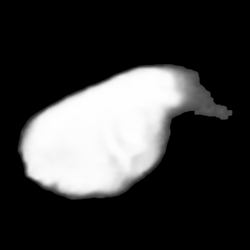</p>
<p align="center"><em>body_ref_mask_clean</em></p>

<table class="figure-pair">
  <tr>
    <td>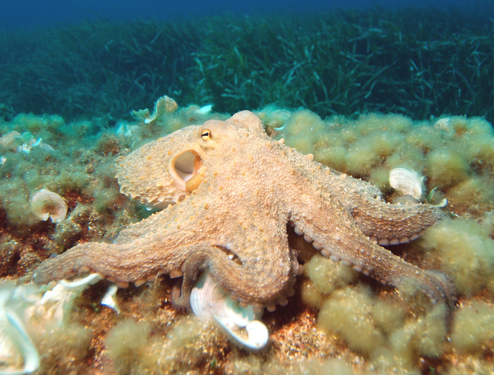</td>
    <td>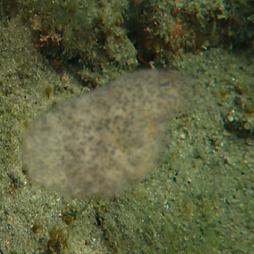</td>
  </tr>
  <tr class="figure-labels">
    <td align="center">reference image</td>
    <td align="center">octopus_on_environment</td>
  </tr>
</table>

**图 11**　失败案例二的统一展示版式。上方单独展示清洗后的分割 mask，下方展示原始参考图 `Octopus.jpg` 与最终合成结果。

<p class="indent">在 `real_run_ref3` 中，参考图 [Octopus.jpg](/Users/junye/Documents/code/visualstudio/cephalopod%20camouflage/input/Octopus.jpg) 的主体与背景分离较差，导致分割后只得到一个连贯但不完整的身体块。其后果是：即使纹理本身开始接近章鱼皮肤，整体仍然只像一块被贴到沙地上的皮肤片，而不是完整个体。</p>

#### 4.4.3 失败案例三：局部纹理已有提升，但个体感不足

<p align="center">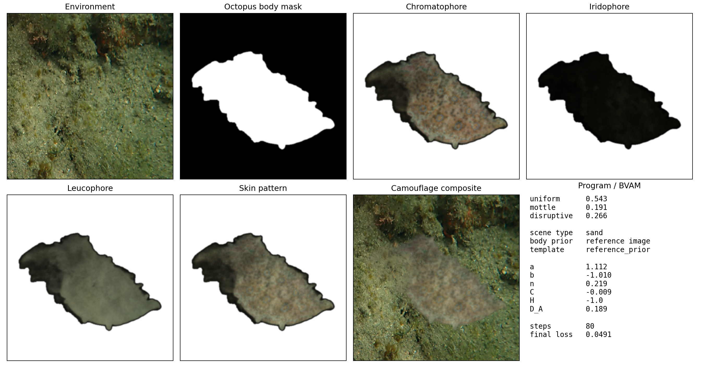</p>
<p align="center"><em>diagnostics</em></p>

<table class="figure-pair">
  <tr>
    <td></td>
    <td></td>
  </tr>
  <tr class="figure-labels">
    <td align="center">reference image</td>
    <td align="center">octopus_on_environment</td>
  </tr>
</table>

**图 12**　失败案例三的统一展示版式。上方单独展示诊断图，下方展示原始参考图与最终合成图。原始参考图提供了较强的局部皮肤质感，但姿态信息不足，因此最终结果更像“皮肤贴片”。 

<p class="indent">`real_run_ref_zhangyu_v1` 说明了另一类失败：局部皮肤质感已经比早期版本真实，但由于参考图本身更像局部背部纹理，而不是完整章鱼姿态，因此最终输出更像“真实皮肤贴片”，而不是完整伪装个体。</p>

#### 4.4.4 失败案例讨论

<p class="indent">综合这些失败案例可以看出，当前系统的主要瓶颈已经不在于：</p>

- `uniform / mottle / disruptive` 不会分配
- `n / C / D_A` 不会选
- 神经网络控制器没有引入

<p class="indent">真正的瓶颈是：</p>

- 完整章鱼 body prior 不足
- 真实参考图的分割质量不稳定
- 当前结果仍然是二维 silhouette 驱动，而非三维姿态与 papillae 几何驱动
- `iridophore` 暗层在部分版本中仍偏重，使最终合成显得发黑发冷

## 5. 讨论

<p class="indent">本文方法的价值不在于证明已经“复现章鱼神经系统”，而在于提出了一个结构上合理、计算上可运行、方法上可解释的桥接模型。它把生物学中关于视觉驱动、分层控制和皮肤多层结构的认识，转化为一个可以直接运行和迭代的模拟框架。对计算机科学而言，这提供了一条不同于黑箱式图像生成的路径：通过显式的控制层与动力学层耦合，提高模型的可解释性与可控性；对生物启发计算而言，这则提供了一个能够快速测试不同控制假设、纹理机制与外观渲染策略的平台。</p>

<p class="indent">当前项目的多个版本结果还表明，一个真正有意义的头足类伪装模拟系统，不能只看像素误差或内部 loss。前期版本已经多次展示：即使 `final loss` 下降，若 body prior 错误，输出仍然会显得图标化。相反，引入真实 silhouette 模板和神经控制器后，虽然参数变化幅度并不总是剧烈，但整个系统的结构合理性明显增强。因此，当前最值得继续推进的方向已经非常明确：沿着 `神经控制 + 多尺度 Turing + 真实 body prior` 的主线继续做，而不是回退到单纯的启发式贴图生成。</p>

<p class="indent">当然，本文仍有明显限制。第一，神经控制器目前仍是机制启发式模块，而非基于真实电生理数据训练的生理模型。第二，当前的 body prior 仍以二维 silhouette 为主，无法表达真实章鱼的三维体态和 papillae 起伏。第三，虽然三层皮肤渲染已经建立，但仍属于近似外观合成，而非严格的结构色光谱仿真。未来若要进一步推进，最直接的方向包括：建立更大的真实章鱼 silhouette 模板库、引入动态伪装视频做反馈控制拟合、把 papillae 几何和 reflectin 光学层真正纳入模型。</p>

## 6. 结论

<p class="indent">本文提出了一个将环境视觉编码、神经控制式程序选择、多尺度 BVAM/Turing 图案生成、身体先验约束、三层皮肤渲染与反馈优化整合起来的头足类伪装计算模拟框架。与仅依赖启发式规则或端到端图像生成的方法不同，本文强调通过显式的层级分解保留模型解释性：神经网络负责环境到控制变量的桥接，reaction-diffusion 负责局部皮肤图案自组织，皮肤渲染层负责将图案转化为更接近头足类结构逻辑的外观输出。结合当前项目已生成的多个版本结果可以看出，神经网络主线版本，尤其是卷积式神经控制版本，已经表现出最稳定的参数组织和最低的内部误差；而当前最主要的瓶颈已不再是参数本身，而是完整 body prior 与真实三维形态的缺失。总体而言，本文给出了一条将神经生物学启发、Turing 图案形成理论和计算机模拟系统耦合起来的可行路线。</p>

## 参考文献

1. Iskarous K, Mather J, Alupay J. *A Turing-based bimodal population code can specify Cephalopod chromatic skin displays*. arXiv. https://arxiv.org/abs/2205.11500
2. Ishida T. *A model of octopus epidermis pattern mimicry mechanisms using inverse operation of the Turing reaction model*. PLoS ONE. https://pubmed.ncbi.nlm.nih.gov/34379702/
3. Montague TG. *Neural control of cephalopod camouflage*. Current Biology. https://pubmed.ncbi.nlm.nih.gov/37875091/
4. Messenger JB. *Cephalopod chromatophores: neurobiology and natural history*. Biological Reviews. https://doi.org/10.1017/S1464793101005772
5. *Reconstruction of Dynamic and Reversible Color Change using Reflectin Protein*. Scientific Reports. https://www.nature.com/articles/s41598-019-41638-8
6. Peking University seminar report on cephalopod camouflage mechanisms. https://mgv.pku.edu.cn/xwzx/xw/f2323afbb4bc4551a5b40c7fa842755a.htm
